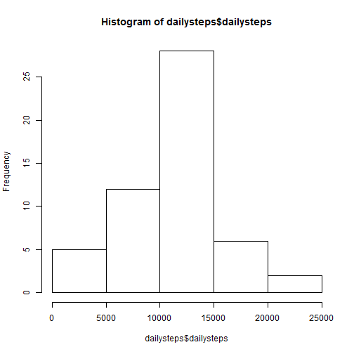
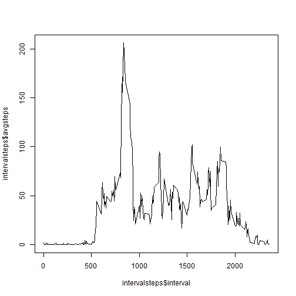
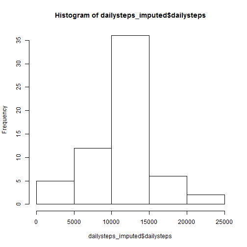
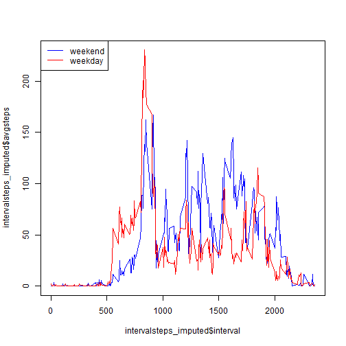

### I. Loading and preprocessing the data

Load libraries, read in activity.csv, and create data frame without NAs

```r
library(dplyr)
library(knitr)


activity <- read.csv("activity.csv")

activity_nona <- activity %>% 
  filter(!is.na(steps))
```

### II. What is mean total number of steps taken per day?
#### 1. Calculate the total number of steps taken per day


```r
dailysteps <- activity_nona %>% 
  group_by(date) %>% 
  summarize(dailysteps=sum(steps))
sample_n(dailysteps,10)
```

```
## Source: local data frame [10 x 2]
## 
##          date dailysteps
## 35 2012-11-08       3219
## 17 2012-10-19      11829
## 6  2012-10-07      11015
## 9  2012-10-11      10304
## 5  2012-10-06      15420
## 7  2012-10-09      12811
## 43 2012-11-19       8841
## 48 2012-11-24      14478
## 29 2012-10-31      15414
## 30 2012-11-02      10600
```
 
#### 2. Make a histogram of the total number of steps taken each day

```r
hist(dailysteps$dailysteps)
```

 

#### 3. Calculate and report the mean and median of the total number of steps taken per day


```r
mean(dailysteps$dailysteps)
```

```
## [1] 10766.19
```

```r
median(dailysteps$dailysteps)
```

```
## [1] 10765
```

### III. What is the average daily activity pattern?
#### 1. Make a time series plot (i.e. type = "l") of the 5-minute interval (x-axis) and the average number of steps taken, averaged across all days (y-axis)


```r
intervalsteps <- activity_nona %>%
  group_by(interval) %>%
  summarize(avgsteps=mean(steps))
intervalsteps
```

```
## Source: local data frame [288 x 2]
## 
##    interval  avgsteps
## 1         0 1.7169811
## 2         5 0.3396226
## 3        10 0.1320755
## 4        15 0.1509434
## 5        20 0.0754717
## 6        25 2.0943396
## 7        30 0.5283019
## 8        35 0.8679245
## 9        40 0.0000000
## 10       45 1.4716981
## ..      ...       ...
```

```r
plot(intervalsteps$interval,intervalsteps$avgsteps, type = "l")
```

 

     
#### 2. Which 5-minute interval, on average across all the days in the dataset, contains the maximum number of steps?


```r
intervalsteps %>% filter(avgsteps==max(avgsteps))
```

```
## Source: local data frame [1 x 2]
## 
##   interval avgsteps
## 1      835 206.1698
```

### IV. Imputing missing values
#### 1. Calculate and report the total number of missing values in the dataset (i.e. the total number of rows with NAs)


```r
activity %>% filter(is.na(steps)) %>% summarize(length(date))
```

```
##   length(date)
## 1         2304
```

##### 2. Devise a strategy for filling in all of the missing values in the dataset. The strategy does not need to be sophisticated. For example, you could use the mean/median for that day, or the mean for that 5-minute interval, etc.

Will use the mean of the 5-minute intervals


#### 3. Create a new dataset that is equal to the original dataset but with the missing data filled in.

```r
activity_imputed <- activity %>% left_join(intervalsteps, by = "interval")

activity_imputed$steps <- ifelse(is.na(activity_imputed$steps),activity_imputed$avgsteps,activity_imputed$steps)
activity_imputed$avgsteps <- NULL

sample_n(activity_imputed,10)
```

```
##           steps       date interval
## 17516  40.01887 2012-11-30     1935
## 8467    0.00000 2012-10-30      930
## 10391   0.00000 2012-11-06      150
## 11625 195.92453 2012-11-10      840
## 11302  18.33962 2012-11-09      545
## 11187  96.00000 2012-11-08     2010
## 3929  505.00000 2012-10-14     1520
## 14677 100.00000 2012-11-20     2300
## 14477   0.00000 2012-11-20      620
## 2207  102.11321 2012-10-08     1550
```

#### 4. Make a histogram of the total number of steps taken each day and Calculate and report the mean and median total number of steps taken per day. Do these values differ from the estimates from the first part of the assignment? What is the impact of imputing missing data on the estimates of the total daily number of steps?


```r
dailysteps_imputed <- activity_imputed %>% 
  group_by(date) %>% 
  summarize(dailysteps=sum(steps))
hist(dailysteps_imputed$dailysteps)
```

 

Values differ substantially. The histogram is now skewed toward the values that were imputed.

### V. Are there differences in activity patterns between weekdays and weekends?
#### 1. Create a new factor variable in the dataset with two levels - "weekday" and "weekend" indicating whether a given date is a weekday or weekend day.


```r
activity_imputed$weekday <- weekdays(as.Date(activity_imputed$date))

activity_imputed$daytype <- ifelse(grepl("(Saturday|Sunday)",activity_imputed$weekday),"weekend","weekday")
```

#### 2. Make a panel plot containing a time series plot (i.e. type = "l") of the 5-minute interval (x-axis) and the average number of steps taken, averaged across all weekday days or weekend days (y-axis). See the README file in the GitHub repository to see an example of what this plot should look like using simulated data.


```r
intervalsteps_imputed <- activity_imputed %>%
  group_by(interval,daytype) %>%
  summarize(avgsteps=mean(steps))

colors <- c("blue","red")

plot(intervalsteps_imputed$interval,intervalsteps_imputed$avgsteps, type="n")
temp <- filter(intervalsteps_imputed, daytype=="weekend")
lines(temp$interval,temp$avgsteps, type="l", col=colors[1])
temp <- filter(intervalsteps_imputed, daytype=="weekday")
lines(temp$interval,temp$avgsteps, type="l", col=colors[2])
legend("topleft", c("weekend","weekday"), lty = 1, col=colors)
```

 
